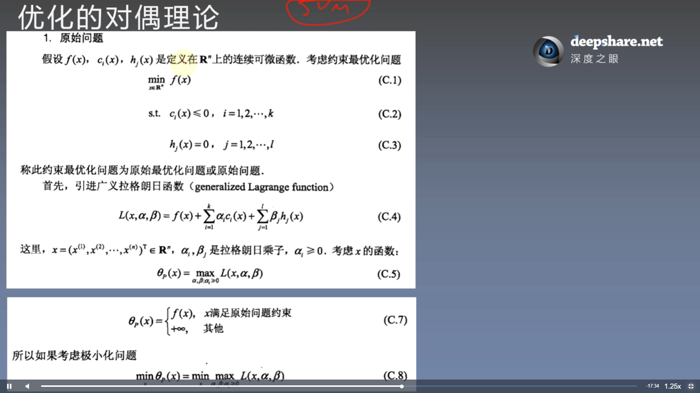

# 带约束的优化
## 等式约束

## 不等式约束
   

$L(x, \lambda, \mu) = f(x) - \lambda * g(x) - \mu * m(x)$  
需要满足条件  
$$\left\{ \begin{aligned} L_x = 0 \\ L_\lambda = 0 \\ l_\mu = 0 \\ m(x) <= 0 \\ \mu * m(x) = 0 & (KKT条件) \end{aligned} \right.$$

# 优化的对偶理论

